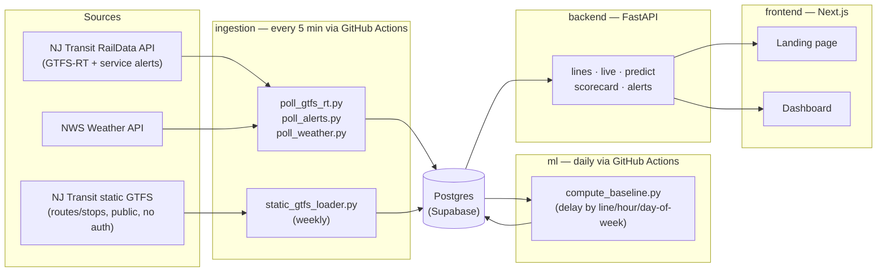

# OnTrack Newark

A live reliability dashboard and predictive delay-risk tool for NJ Transit rail lines serving Newark — Northeast Corridor, North Jersey Coast Line, Raritan Valley Line, Montclair-Boonton Line, Morris & Essex Line, and the Gladstone Branch, all through Newark Penn Station / Newark Broad Street into NYC. Built entirely on public data (NJ Transit's RailData API, public static GTFS, NWS weather) — no PII.

**Status**: live. Real GTFS-RT delay data, weather, static schedules, and service alerts are flowing into production Postgres on a schedule via GitHub Actions. Backend and frontend run locally today (see Setup); a hosted public URL is the next step.

## What it does
- **Live status** per line — current delay for active trips, updated every 5 minutes from NJ Transit's real-time feed.
- **Predicted delay risk** — a statistical baseline (delay averaged by line/hour/day-of-week) scores upcoming departures, honestly reporting "not enough data yet" rather than fabricating a number where the sample is too small.
- **Reliability scorecard** — rolling 7/30-day on-time percentage per line.
- **Service alerts** — real NJ Transit cancellation/delay advisories, filtered to Newark-area lines.
- **A public landing page** telling the actual story of the project — see `docs/landing-page-brief.md` for its design history.

## Architecture



Each directory is owned by a distinct role (see `AGENTS.md`) so depth doesn't get diluted across layers — `/ingestion` never touches presentation, `/frontend` never touches external APIs directly, etc.

## Project structure
```
/ingestion   → data ingestion (GTFS-RT, alerts, static GTFS, weather)
/backend     → FastAPI app
/ml          → prediction baseline + (future) LightGBM model
/frontend    → Next.js dashboard + landing page
/infra       → GitHub Actions workflows, deployment config
```

See [`CLAUDE.md`](CLAUDE.md) for full architecture context, [`AGENTS.md`](AGENTS.md) for the engineering org structure, [`SKILLS.md`](SKILLS.md) for reusable workflows, and [`ENGINEERING_LOG.md`](ENGINEERING_LOG.md) for a running, dated history of what's been built — including real bugs hit and fixed along the way.

## Setup
Each layer has its own README with exact setup steps:
- [`/ingestion/README.md`](ingestion/README.md)
- [`/backend/README.md`](backend/README.md)
- [`/ml/README.md`](ml/README.md)
- [`/frontend/README.md`](frontend/README.md)
- [`/infra/README.md`](infra/README.md) — scheduled jobs and required GitHub secrets

## What's next
- Deploy the backend (Render/Railway) and frontend (Vercel) to get a public URL, rather than local-only.
- Once 2-3+ weeks of real delay data has accumulated, train the v2 LightGBM model and compare against the statistical baseline.
