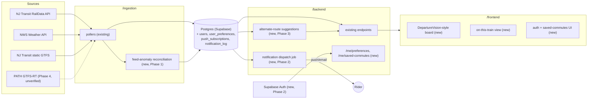

# PRD — OnTrack: Beyond Delay Tracking

**Status**: Phase 1 shipped 2026-08-02. The scope described below has since been expanded from Newark-area-only to statewide (14 heavy-rail lines, up from 8) by explicit decision — see `CLAUDE.md`'s "Current status" and `ENGINEERING_LOG.md` for what actually shipped. The research and vision below still ground the product; the original "Newark-area rail lines only" constraint in section 4 has been superseded.

## 1. Problem

v1 shipped a solid, honest core: live delay status, a statistical + LightGBM delay-risk prediction, a reliability scorecard, and filtered service alerts, all on public data. That's a good showcase of data engineering and ML discipline, but on its own it's a narrower slice of "what a Newark-area rail rider actually needs" than it could be. Kartikey's read: the project should feel like it's solving real rider pain, not just demonstrating a pipeline.

## 2. Research: what riders are actually missing

Grounded in Reddit/Facebook rider complaints, app store reviews, and a DOT-commissioned NJ Transit rider survey (all gathered 2026-08-01):

| Finding | Source |
|---|---|
| The redesigned NJT app buried DepartureVision (the classic live-board view) behind extra navigation, and removed "favorites" | [Yahoo/AOL](https://www.yahoo.com/news/us/articles/nj-transit-riders-slam-mobile-113050561.html), [justuseapp reviews](https://justuseapp.com/en/app/589549928/nj-transit-mobile-app/reviews) |
| Real-time data is widely distrusted — vehicles appear/disappear from tracking, schedules show already-departed trains; NJ Transit attributes this to feed problems, not app bugs | [AOL](https://www.aol.com/nj-transit-bus-time-knows-083103134.html) |
| Riders can't see upcoming stops while on a moving train; transfers aren't shown upfront in trip results anymore (a regression from the old app) | justuseapp reviews |
| The single most-desired feature in a DOT-commissioned rider survey was **targeted (geotargeted) service alerts** — scoped to the lines/stations a rider actually uses | [DOT final report](https://rosap.ntl.bts.gov/view/dot/37513) |
| NJT has an aggregate "How Full Is My Ride" crowding indicator but explicitly lacks car-by-car crowding (unlike LIRR's TrainTime) | [njtransit.com](https://www.njtransit.com/news-events/how-full-my-ride) |
| Quiet Commute cars exist on specific NEC peak trains but aren't surfaced as a simple lookup anywhere | [NJT press release](https://www.njtransit.com/press-releases/nj-transit-expands-popular-quiet-commute-initiative) |
| Elevator/escalator outage status is published only on NJT's website/app UI — no evidence of a public API (unlike MTA) | [njtransit.com/railaccessibility](https://www.njtransit.com/railaccessibility) |
| A third-party app (TrackRat) already forecasts delay/cancellation probability across NJT/Amtrak/PATH/LIRR/Metro-North | search findings, 2026-08-01 |
| NJT's developer portal (`developer.njtransit.com`) hosts GTFS, GTFS-RT, and the RailData API — confirms the current ingestion approach is on the sanctioned, documented path | search findings, 2026-08-01 |

**Read on competitive positioning**: predictive delay risk (v1's core feature) is validated as the right bet — TrackRat proves riders want it — but it's no longer a unique differentiator by itself. The differentiation now has to come from *depth*: explainability, Newark-hub transfer awareness, weather correlation, and honesty about data quality (which NJT's own app conspicuously lacks).

## 3. Vision

OnTrack exists to fix what NJ Transit's own app gets wrong, statewide — not to be a smaller, Newark-only copy of it. Three concrete, documented gaps this product closes: NJ Transit buries its own live departure board behind extra navigation; it doesn't show transfers up front anymore; and it only tells you a train is late after you're already standing on the platform, never before.

The product thesis, stated plainly: combine into one place the features that are scattered across NJ Transit's app and third-party alternatives (a real live board, a transfer lookup, a trip companion view), and make the one thing none of them do well — delay prediction — genuinely more accurate over time by training a real model on real accumulated data, not just a fixed historical average. The bar for success isn't "more features than NJ Transit's app." It's this: a rider opens OnTrack instead of NJ Transit's app, for any line in the state, and can explain in one sentence why.

## 4. Constraints

**Carried forward from v1** (non-negotiable):
- Heavy/commuter rail statewide (14 lines — expanded from the original 8 Newark-area-only lines on 2026-08-02, see `ENGINEERING_LOG.md`) — no bus, no light rail.
- Public/documented data sources only (GTFS-RT, static GTFS, RailData API, NWS weather).
- Honest uncertainty — "not enough data yet" beats a fabricated number, always.

**Relaxed for v2** (by explicit decision, 2026-08-01):
- Lightweight user accounts are now in scope (email-based auth via Supabase Auth, since the project already runs on Supabase Postgres) — needed for saved preferences and server-side push/email delivery.
- Still **no** payment data, no government ID, no ticketing/fare purchase. That functionality would require an official commercial partnership with NJ Transit and PCI-DSS scope neither of which fits a portfolio project — explicitly out of scope, not just deferred.

## 5. Feature catalog

| Feature | Rider pain point it addresses | Data feasibility | Phase | Owning directory |
|---|---|---|---|---|
| DepartureVision-style live board | NJT buried the classic board view | Existing `/live` data, presentation-only | 1 | `/frontend` |
| "On this train" companion view (ordered upcoming stops) | Can't see upcoming stops while riding | Existing static GTFS `stop_times` + `/live` | 1 | `/frontend`, minor `/backend` |
| Transfer-aware Newark hub view | Transfers no longer shown upfront | Existing static GTFS (shared stations across lines) | 1 | `/frontend`, minor `/backend` |
| Weather-aware proactive commute advisories | No proactive heads-up before a bad commute | Already-ingested weather data, new summary logic | 1 | `/backend` |
| Data-confidence indicator | NJT's own feed is widely distrusted | New anomaly-reconciliation logic on ingested GTFS-RT | 1 | `/ingestion`, `/backend` |
| Quiet Commute car lookup | Not surfaced anywhere in NJT's app | Static rule list (published NEC peak-train set) | 1 | `/backend`, `/frontend` |
| Accounts (email/magic link) | Prerequisite for personalization below | Supabase Auth | 2 | `/backend`, `/infra` |
| Saved lines/stations + notification preferences | Prerequisite for targeted alerts | New DB tables | 2 | `/backend`, `/frontend` |
| Targeted push/email service alerts | **#1 rider-requested feature** per DOT survey | New notification dispatch job | 2 | `/backend`, `/infra` |
| Alternate-route suggestions on high predicted risk | Riders want actionable predictions, not just a number | Existing predictions + static GTFS, rule-based | 3 | `/backend` |
| Personalized daily commute digest | Combine weather + risk + alerts proactively | Builds on Phase 1 + 2 | 3 | `/backend` |
| Cost/time-vs-driving comparison | Helps riders make a real decision | Public fare table + documented gas/toll assumptions | 3 | `/backend`, `/frontend` |
| Elevator/escalator accessibility status | Accessibility is currently app/website-only | **Feasibility unverified** — no known public API | 4 | `/ingestion` (if feasible) |
| PATH connection awareness at Newark Penn | Multi-modal riders transfer to PATH into NYC | **Feasibility unverified** — confirm PATH GTFS-RT public access | 4 | `/ingestion` (if feasible) |
| Crowdsourced crowding input | Mirrors NJT's own approach on non-instrumented lines | New ingestion + moderation logic | 4 | `/ingestion`, `/backend` |

**Explicitly out of scope**: ticketing/payment/fare purchase, car-by-car crowding (no data source exists), expansion beyond Newark-area rail into full statewide bus coverage.

## 6. Phased roadmap

- **Phase 1 — Restore & Trust**: no new architecture (accounts, infra) required; ships value immediately on top of v1. Exit criteria: all six Phase 1 features live and verified against real data/UI.
- **Phase 2 — Personalize**: introduces Supabase Auth + notification dispatch. Exit criteria: a rider can sign up, save lines, and receive at least one real targeted alert end-to-end.
- **Phase 3 — Predict Smarter**: builds on Phase 1 + 2's data and accounts. Exit criteria: alternate-route suggestions and the daily digest are live and demoable.
- **Phase 4 — Stretch**: gated on feasibility checks (elevator/escalator API, PATH GTFS-RT access) before any implementation commitment.

## 7. Architecture deltas

- New DB tables: `users` (via Supabase Auth), `user_preferences`, `push_subscriptions`, `notification_log`.
- `/backend` gains auth verification, `/me/preferences`, `/me/saved-commutes`, `/notifications/subscribe`, and a scheduled notification-dispatch job (owned by `backend-engineer-agent`, same pattern as `/ml`'s daily batch job — no new team role needed).
- `/infra` gains Supabase Auth config and push/email provider secrets (Web Push VAPID keys and/or a transactional email provider).
- `/ingestion` and `/ml` are unaffected through Phase 3; Phase 4 stretch items would add new pollers only after feasibility is confirmed.

## 8. Success metrics / demo narrative

- Phase 1 alone upgrades the meetup/conference demo from "here's a delay predictor" to "here's what NJ Transit's own app got worse at, fixed."
- Phase 2's targeted alerts directly answers the single feature NJT's own riders said they wanted most — a strong, citable talking point.
- Data-confidence indicator is a distinctive, defensible differentiator: it turns NJT's most-cited weakness (data trust) into this project's strength.

## 9. Risks

- Phase 4 items are feasibility-gated for a reason — don't commit engineering time before confirming a data source exists and is ToS-compliant (especially any scraping of `njtransit.com`).
- Accounts add real surface area (auth, session handling, notification deliverability) that v1 never had — scope Phase 2 conservatively and don't let it block Phase 1 from shipping first.
- Push notification deliverability (browser permissions, email spam filtering) is a real product problem, not just an engineering one — validate manually before treating Phase 2 as "done."
